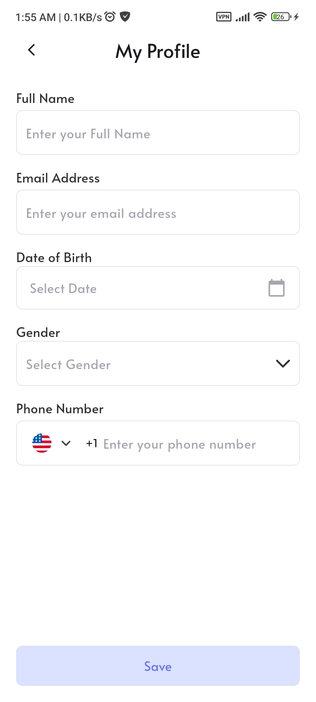

# ShopZen - E-Commerce Mobile Application 🛍️

<div align="center">
  
  
  [](https://flutter.dev)
  [](https://dart.dev)
  [](https://bloclibrary.dev)
  [](LICENSE)

  ### *Your one-stop destination for hassle-free online shopping*
  
  🎓 **Graduation Project** | Flutter Master Class @ InnovaDigits
</div>

---

## � Table of Contents

- [About The Project](#-about-the-project)
- [Features](#-features)
- [Architecture](#️-architecture)
- [Tech Stack](#️-tech-stack)
- [Getting Started](#-getting-started)
- [Screenshots](#-screenshots)
- [Theme & Styling](#-theme--styling)
- [Database Schema](#-database-schema)
- [API Integration](#-api-integration)
- [Testing](#-testing)
- [Build & Release](#-build--release)
- [Team & Project Info](#-team--project-info)
- [Project Outcomes](#-project-outcomes--learning)
- [Future Enhancements](#-future-enhancements)

---

## �📱 About The Project

**ShopZen** is a modern, feature-rich e-commerce mobile application developed as the **graduation project for the Flutter Master Class at InnovaDigits Academy**. Built with Flutter and following industry best practices, this app delivers a seamless shopping experience with elegant UI, smooth animations, and robust functionality across both iOS and Android platforms.

### 📅 Project Timeline
- **Duration**: 1 Month (4 Sprints)
- **Sprint 1-3**: 1 week each
- **Sprint 4**: 2 weeks (final polish and testing)
- **Methodology**: Agile/Scrum with GitHub Organization
- **Completion**: November 2025

### 🎯 Project Management
This project was developed using **GitHub Organization** for comprehensive project management:
- ✅ Sprint planning and task allocation
- ✅ Issue tracking and bug management
- ✅ Pull request reviews and code collaboration
- ✅ Branch strategy (staging → main)
- ✅ Team coordination and communication

### 📈 Development Process

#### Sprint Breakdown:
- **Sprint 1** (Week 1): Project setup, authentication, and core structure
- **Sprint 2** (Week 2): Home screen, product listings, and navigation
- **Sprint 3** (Week 3): Cart, favorites, and database integration
- **Sprint 4** (Weeks 4-5): Checkout flow, polish, testing, and documentation

#### Daily Workflow:
1. 🌅 Morning standup (async via GitHub Issues)
2. 💻 Feature development on separate branches
3. 🔄 Pull requests with code reviews
4. ✅ Testing and bug fixes
5. 📝 Documentation updates
6. 🎯 Sprint retrospective and planning

### ✨ Key Highlights

- 🎨 **Beautiful UI/UX** - Modern design with smooth animations using Animate_do
- 🌓 **Dark Mode Support** - Complete theme switching capability
- 🌍 **Multi-language Support** - Arabic and English localization
- 📦 **Offline Cart** - SQLite local database for cart persistence
- ❤️ **Favorites Management** - Save and manage favorite products locally
- 🔍 **Smart Search** - Real-time product search functionality
- 🛒 **Complete Shopping Flow** - From browsing to checkout
- 📱 **Responsive Design** - Optimized for various screen sizes

---

## 🎯 Features

### 🔐 Authentication
- **Splash Screen** - Animated app intro with logo
- **Onboarding** - Welcome screen for first-time users
- **Login/Signup** - Multiple authentication methods:
  - Email login
  - Google authentication
  - Apple authentication
- **Session Management** - Persistent login state

### 🏠 Home & Shopping
- **Product Catalog** - Browse hot deals and featured products
- **Categories** - Organized product categories with filtering
- **Product Details** - Comprehensive product information:
  - Multiple product images with carousel
  - Price and discount display
  - Stock availability
  - Customer reviews and ratings
  - Related products
- **Search Products** - Smart search with real-time results
- **Banner/Carousel** - Promotional banners and advertisements

### ❤️ Favorites
- **Wishlist** - Add/remove products to favorites
- **Local Storage** - SQLite database for offline favorites
- **Quick Access** - Dedicated favorites screen

### 🛒 Shopping Cart
- **Cart Management** - Add, update, and remove items
- **Quantity Control** - Adjust product quantities
- **Price Calculation** - Real-time total and subtotal
- **Persistent Cart** - SQLite database for cart items
- **Empty Cart State** - Beautiful empty state illustrations

### 💳 Checkout
- **Address Management** - Add and select delivery addresses
- **Order Summary** - Review items before purchase
- **Payment Methods** - Multiple payment options
- **Payment Input** - Secure card information input
- **Order Confirmation** - Success dialog with order details

### 📦 Orders
- **Order History** - View all past orders
- **Order Details** - Track order status and items

### 👤 Profile & Settings
- **User Profile** - View and edit profile information
- **Account Settings** - Manage account preferences
- **Notification Settings** - Control app notifications
- **Theme Toggle** - Switch between light and dark modes
- **Logout** - Secure logout with confirmation

### 🔔 Notifications
- **Notification Center** - View all notifications
- **Empty State** - Elegant empty notifications screen

---

## 🏗️ Architecture

The project follows **Clean Architecture** principles with a feature-first folder structure:

```
lib/
├── app/
│   ├── bloc/              # Global state management (Settings, Theme)
│   ├── functions/         # Utility functions
│   ├── models/           # Shared models (ProductModel)
│   └── widgets/          # Reusable widgets
├── configurations/
│   ├── app_endpoints.dart    # API endpoint constants
│   ├── app_events.dart       # BLoC events
│   ├── app_states.dart       # BLoC states
│   └── app_theme.dart        # Theme configuration
├── features/
│   ├── authentication/
│   │   ├── ui/
│   │   │   ├── screens/     # Login, Signup, Splash, OnBoarding
│   │   │   ├── widgets/     # Auth-specific widgets
│   │   │   └── blocs/       # Authentication BLoC
│   ├── home_screen/
│   │   ├── ui/              # Home screen UI
│   │   ├── domain/          # Business logic & models
│   │   └── data/            # Data repositories
│   ├── products_details/
│   ├── search_products/
│   ├── cart/
│   ├── favorites/
│   ├── checkout/
│   ├── my_orders/
│   ├── profile/
│   └── notification/
├── handlers/
│   ├── cart_database.dart       # SQLite cart operations
│   ├── favorite_handler.dart    # SQLite favorites operations
│   ├── snackbars_handler.dart   # Custom snackbar utility
│   └── vibration_handler.dart   # Haptic feedback
├── navigation/
│   ├── app_routes.dart          # Route constants
│   └── route_generator.dart     # Route configuration
├── network/
│   ├── app_end_points.dart      # API endpoints
│   └── network_handler.dart     # Dio HTTP client
└── main.dart                    # App entry point
```

### 🎨 Design Patterns Used

- **BLoC Pattern** - State management using flutter_bloc
- **Repository Pattern** - Data layer abstraction
- **Singleton Pattern** - Network handler, database instances
- **Factory Pattern** - Model creation from JSON

### 🔧 Technical Features

#### Performance Optimizations
- ⚡ Lazy loading for product lists
- 🖼️ Image caching and optimization
- 📦 SQLite for local data persistence
- 🔄 Debounced search for better UX
- 💾 Shared preferences for user settings

#### Code Quality
- ✨ Clean code principles
- 📝 Comprehensive code documentation
- 🏗️ Modular and scalable architecture
- 🧪 Testable code structure
- 📋 Consistent naming conventions

#### Security & Best Practices
- 🔒 Secure local storage (SQLite)
- 🌐 HTTPS API communication
- 🔐 Session management
- 🛡️ Input validation
- ⚠️ Error handling and logging

---

## 🛠️ Tech Stack

### Core Framework
- **Flutter** ^3.5.3 - Cross-platform UI framework
- **Dart** ^3.5.3 - Programming language

### State Management
- **flutter_bloc** ^8.1.6 - BLoC state management
- **flutter_localizations** - Internationalization support

### Networking & Data
- **dio** ^5.7.0 - HTTP client for API calls
- **sqflite** ^2.3.0 - Local SQLite database
- **path_provider** ^2.1.2 - File system paths
- **shared_preferences** ^2.3.3 - Local key-value storage

### UI & Animation
- **flutter_svg** ^2.0.16 - SVG image support
- **animate_do** ^3.3.4 - Pre-built animations
- **carousel_slider** ^5.0.0 - Image carousel
- **redacted** ^1.0.13 - Loading skeleton screens
- **awesome_snackbar_content** ^0.1.4 - Beautiful snackbars

### User Experience
- **vibration** ^2.0.1 - Haptic feedback
- **cupertino_icons** ^1.0.8 - iOS style icons
- **intl** 0.20.2 - Internationalization utilities

### Development
- **flutter_test** - Testing framework
- **flutter_lints** ^5.0.0 - Dart linting rules
- **flutter_launcher_icons** ^0.14.2 - App icon generation

---

## 🚀 Getting Started

### Prerequisites

Before you begin, ensure you have the following installed:

- ✅ **Flutter SDK** (^3.5.3) - [Install Flutter](https://docs.flutter.dev/get-started/install)
- ✅ **Dart SDK** (^3.5.3) - Comes with Flutter
- ✅ **Android Studio** or **VS Code** - [Download](https://developer.android.com/studio)
- ✅ **Git** - [Install Git](https://git-scm.com/downloads)
- ✅ **Android Emulator** or **iOS Simulator** (or physical device)

### Quick Start ⚡

```bash
# Clone the repository
git clone https://github.com/innova-academy-org/team-2-graduation.git

# Navigate to project directory
cd innova-academy-e-commerce

# Install dependencies
flutter pub get

# Check for any issues
flutter doctor

# Run the app (debug mode)
flutter run
```

### Detailed Installation

1. **Clone the repository**
   ```bash
   git clone https://github.com/innova-academy-org/team-2-graduation.git
   cd innova-academy-e-commerce
   ```

2. **Install dependencies**
   ```bash
   flutter pub get
   ```

3. **Generate app icons (optional)**
   ```bash
   flutter pub run flutter_launcher_icons
   ```

4. **Run the app**
   
   For Android:
   ```bash
   flutter run -d android
   ```
   
   For iOS (macOS only):
   ```bash
   flutter run -d ios
   ```
   
   For specific device:
   ```bash
   flutter devices           # List available devices
   flutter run -d <device_id>
   ```

5. **Build release version**
   ```bash
   # Android APK
   flutter build apk --release
   
   # Android App Bundle
   flutter build appbundle --release
   
   # iOS (macOS only)
   flutter build ios --release
   ```

### Configuration

#### API Configuration
The app uses DummyJSON API for demo data. Update endpoints in:
```dart
lib/configurations/app_endpoints.dart
lib/network/app_end_points.dart
```

#### Firebase (Optional)
To enable Firebase services:
1. Add your `google-services.json` to `android/app/`
2. Configure Firebase in your Flutter project
3. Update authentication methods accordingly

---

## 📱 Screenshots

### 🌟 Light Mode

<div align="center">

| Login | Home | Product Details |
|:-----:|:----:|:---------------:|
|  |  |  |

| Cart | Favorites | Search |
|:----:|:---------:|:------:|
|  |  |  |

| Checkout | Orders | Profile |
|:--------:|:------:|:-------:|
|  |  |  |

</div>

### 🌙 Dark Mode

<div align="center">

| Dark Home | Dark Details | Dark Cart |
|:---------:|:------------:|:---------:|
|  |  |  |

| Dark Search | Dark Profile | Dark Checkout |
|:-----------:|:------------:|:-------------:|
|  |  |  |

</div>

### 📊 Project Management

<div align="center">
  
  <p><em>Project Architecture & Flow Diagram</em></p>
</div>

<div align="center">
  
  <p><em>Sprint Planning & Task Distribution</em></p>
</div>

---

## 🎨 Theme & Styling

### Color Palette
```dart
Main Color:      #1f402b (Dark Green)
Main Grey:       #68656E
Light Primary:   #FBFBFC
Dark Primary:    #323135
Dark Secondary:  #FBFBFC
```

### Typography
- **Font Family**: Alata
- **Custom fonts** available in `assets/fonts/`

### Dark Mode
The app features a complete dark mode theme that can be toggled from the profile settings. Theme preference is persisted using SharedPreferences.

---

## 🌐 Localization

The app supports multiple languages:
- 🇺🇸 **English** (`assets/lang/en.json`)
- 🇸🇦 **Arabic** (`assets/lang/ar.json`)

To add a new language:
1. Create a new JSON file in `assets/lang/`
2. Add translations
3. Update `pubspec.yaml` assets
4. Implement locale switching logic

---

## 📊 Database Schema

### Cart Items Table (SQLite)
```sql
CREATE TABLE cart_items (
  id INTEGER PRIMARY KEY,
  title TEXT,
  image TEXT,
  price REAL,
  quantity INTEGER DEFAULT 1
)
```

### Favorites Table (SQLite)
```sql
CREATE TABLE favorites (
  id INTEGER PRIMARY KEY AUTOINCREMENT,
  imageUrl TEXT,
  title TEXT,
  price REAL,
  oldPrice REAL,
  rating REAL,
  reviewsCount INTEGER,
  isFavorite INTEGER
)
```

---

## 🔌 API Integration

The app integrates with **DummyJSON API** for demonstration:

### Endpoints
- **Products**: `https://dummyjson.com/products`
- **Product Details**: `https://dummyjson.com/products/{id}`
- **Search**: `https://dummyjson.com/products/search`
- **Authentication**: `https://dummyjson.com/auth/login`
- **User Registration**: `https://dummyjson.com/users/add`
- **Orders**: `https://dummyjson.com/carts/user/{id}`

### Network Layer
- **Dio** client with base URL configuration
- Centralized error handling
- Request/Response interceptors support

---

## 🧪 Testing

Run tests with:
```bash
flutter test
```

For coverage:
```bash
flutter test --coverage
```

View coverage report:
```bash
# Generate coverage report (requires lcov)
genhtml coverage/lcov.info -o coverage/html
# Open coverage/html/index.html in browser
```

---

## 🔧 Troubleshooting

### Common Issues and Solutions

<details>
<summary><b>Build fails with "SDK version" error</b></summary>
<br>

Make sure you have Flutter 3.5.3 or higher:
```bash
flutter --version
flutter upgrade
```
</details>

<details>
<summary><b>Dependencies conflict</b></summary>
<br>

Clear cache and reinstall:
```bash
flutter clean
flutter pub get
```
</details>

<details>
<summary><b>App crashes on startup</b></summary>
<br>

1. Check Flutter doctor: `flutter doctor`
2. Rebuild the app: `flutter clean && flutter run`
3. Check device logs for error details
</details>

<details>
<summary><b>Images not loading</b></summary>
<br>

Ensure assets are properly declared in `pubspec.yaml`:
```yaml
flutter:
  assets:
    - assets/images/
    - assets/icons/
```
</details>

<details>
<summary><b>Database errors</b></summary>
<br>

Clear app data:
- Android: Settings → Apps → ShopZen → Clear Data
- iOS: Uninstall and reinstall the app
</details>

<details>
<summary><b>API connection issues</b></summary>
<br>

1. Check internet connection
2. Verify API endpoint is accessible
3. Check for CORS issues (web)
4. Review network logs
</details>

### Need More Help?

- 📚 Check [Flutter Documentation](https://docs.flutter.dev/)
- 💬 Ask on [Stack Overflow](https://stackoverflow.com/questions/tagged/flutter)
- 🐛 Report bugs on [GitHub Issues](https://github.com/innova-academy-org/team-2-graduation/issues)

---

## 📦 Build & Release

### Android
```bash
# Build APK (for testing and distribution)
flutter build apk --release

# Build App Bundle (for Google Play Store)
flutter build appbundle --release

# The output files will be in:
# build/app/outputs/flutter-apk/app-release.apk
# build/app/outputs/bundle/release/app-release.aab
```

### iOS
```bash
# Build for iOS (macOS only)
flutter build ios --release

# Build for iOS with specific target
flutter build ipa --release
```

### Web
```bash
# Build for web deployment
flutter build web --release

# The output will be in: build/web/
```

### Build Tips
- 📱 Test release builds on real devices before distribution
- 🔍 Use `flutter doctor` to check for any issues
- 📝 Update version numbers in `pubspec.yaml` before building
- 🔑 Configure signing keys for Android (keystore) and iOS (certificates)
- 📊 Analyze APK size: `flutter build apk --analyze-size`

---

## 🚀 Deployment Guide

### Publishing to New GitHub Repository

If you want to create your own copy of this project:

```bash
# 1. Create a new repository on GitHub (via web interface)
# 2. Clone this repository
git clone https://github.com/innova-academy-org/team-2-graduation.git
cd team-2-graduation

# 3. Remove the existing remote
git remote remove origin

# 4. Add your new repository as remote
git remote add origin https://github.com/YOUR_USERNAME/YOUR_REPO_NAME.git

# 5. Push to your new repository
git branch -M main
git push -u origin main
```

### Important Notes Before Publishing
- 🔒 **Remove sensitive data**: Check for API keys, secrets, or credentials
- 📝 **Update README**: Change repository links and team information
- ⚖️ **Check License**: Ensure you have proper rights to publish
- 🎨 **Assets**: Verify you have rights to use all images and icons
- 🔧 **Configuration**: Update Firebase config files if using Firebase

---

## 🤝 Contributing

This project was developed as part of the Flutter Master Class graduation requirements. 

### Development Workflow (Used During Project)

1. **Create a feature branch**
   ```bash
   git checkout -b feature/AmazingFeature
   ```

2. **Make your changes and commit**
   ```bash
   git add .
   git commit -m 'Add some AmazingFeature'
   ```

3. **Push to the branch**
   ```bash
   git push origin feature/AmazingFeature
   ```

4. **Open a Pull Request** to `staging` branch for review

5. **Code Review** - Team members review and approve

6. **Merge** - After approval, merge to staging/main

### Our Git Workflow
- Used GitHub Organization for centralized repository
- Implemented branch protection rules
- Mandatory pull request reviews
- CI/CD ready structure
- Issue tracking for task management

---

## 👥 Team & Project Info

### 🎓 Academic Program
**Flutter Master Class @ InnovaDigits**
- **Program**: Advanced Flutter Development
- **Project Type**: Graduation Project
- **Organization**: [innova-academy-org](https://github.com/innova-academy-org)
- **Repository**: [team-2-graduation](https://github.com/innova-academy-org/team-2-graduation)

### 📊 Development Approach
- **Methodology**: Agile/Scrum
- **Project Management**: GitHub Organization & Projects
- **Sprints**: 4 sprints over 1 month
- **Collaboration**: Pull requests, code reviews, issue tracking
- **Version Control**: Git with feature branching

### 🌿 Branch Strategy
- `main` - Production-ready code
- `staging` - Development and testing
- `feature/*` - New features
- `fix/*` - Bug fixes

---

## 📄 License

This project is private and proprietary to InnovaDigits Academy.

---

## 🎯 Project Outcomes & Learning

### ✅ What We Achieved
- ✨ Complete e-commerce application from scratch
- 🏗️ Clean architecture implementation
- 📱 Cross-platform mobile app (iOS & Android)
- 🎨 Beautiful UI with dark mode support
- 💾 Local database integration (SQLite)
- 🌐 RESTful API integration
- 🧪 State management with BLoC pattern
- 👥 Team collaboration using Git & GitHub
- 📋 Agile project management experience

### 💡 Key Learnings
- Flutter advanced concepts and best practices
- State management patterns (BLoC)
- Database design and implementation
- API integration and network handling
- UI/UX design principles
- Git workflow and team collaboration
- Agile methodology and sprint planning
- Code organization and clean architecture

### 📊 Project Statistics
- **Lines of Code**: 10,000+ (Dart)
- **Features**: 10+ major features
- **Screens**: 20+ screens
- **Dependencies**: 15+ packages
- **Database Tables**: 2 (Cart & Favorites)
- **API Endpoints**: 6+ integrated
- **Commits**: 100+ commits
- **Pull Requests**: Multiple reviewed PRs
- **Development Time**: 1 month (4 sprints)
- **Team Size**: Team 2 members

### 🎨 Design Highlights
- **Animations**: Smooth page transitions and micro-interactions
- **Consistency**: Unified design language across all screens
- **Accessibility**: Support for different screen sizes
- **Performance**: Optimized images and lazy loading
- **Themes**: Complete dark and light mode support
- **Icons**: Custom SVG icons for branding
- **Typography**: Custom Alata font family

---

## 🚀 Future Enhancements

### Planned Features
- [ ] Real backend API integration
- [ ] Firebase authentication (Google/Apple Sign-in)
- [ ] Push notifications
- [ ] Payment gateway integration (Stripe/PayPal)
- [ ] Real-time order tracking
- [ ] Social media sharing
- [ ] Product review system
- [ ] Multi-currency support
- [ ] Advanced filtering and sorting
- [ ] Wishlist sharing
- [ ] Voice search capability
- [ ] AR product preview
- [ ] Chat support

---

## 📞 Support

For support and queries:
- Open an issue on GitHub
- Contact the development team

---

## 🙏 Acknowledgments

- **InnovaDigits Academy** - For the comprehensive Flutter Master Class and mentorship
- **Flutter Team** - For creating an amazing cross-platform framework
- **DummyJSON** - For providing free demo API for development
- **GitHub** - For organization and project management tools
- **Open Source Community** - For all the wonderful packages used in this project

---

## ❓ FAQ (Frequently Asked Questions)

<details>
<summary><b>Is this a real e-commerce app?</b></summary>
<br>
This is a graduation project demonstrating a complete e-commerce flow. It uses DummyJSON API for demo data. For production use, you would need to integrate a real backend API and payment gateway.
</details>

<details>
<summary><b>Can I use this project for learning?</b></summary>
<br>
Absolutely! This project showcases Flutter best practices, BLoC pattern, clean architecture, and more. Feel free to explore the code and learn from it.
</details>

<details>
<summary><b>Does it work offline?</b></summary>
<br>
Partially. The cart and favorites are stored locally using SQLite, so they persist offline. However, product data and user authentication require an internet connection.
</details>

<details>
<summary><b>How long did it take to build?</b></summary>
<br>
The project was completed in 4 sprints over 1 month (approximately 4-5 weeks) as part of the Flutter Master Class graduation requirements.
</details>

<details>
<summary><b>What's the difference between this and other e-commerce apps?</b></summary>
<br>
This project emphasizes clean code, proper architecture, state management best practices, and real-world development workflow using GitHub Organization and Agile methodology.
</details>

<details>
<summary><b>Can I contribute or use this code?</b></summary>
<br>
This is a private academic project. Please respect the license and academic integrity. You can fork it for learning purposes and reference, but not for commercial use.
</details>

---

## 📞 Contact & Support

For inquiries about this project:
- 📧 Open an issue on [GitHub](https://github.com/innova-academy-org/team-2-graduation/issues)
- 🌐 Visit [InnovaDigits](https://innovadigits.com)
- 💼 Connect with the team on LinkedIn

---

## 🔗 Quick Links

- [📚 Flutter Documentation](https://docs.flutter.dev/)
- [📦 Pub.dev Packages](https://pub.dev/)
- [🎨 Material Design](https://material.io/design)
- [💙 BLoC Pattern](https://bloclibrary.dev/)
- [🏢 InnovaDigits](https://innovadigits.com)

---

<div align="center">

### 🎓 Flutter Master Class Graduation Project

**Made with ❤️ and ☕ by Team 2**

**InnovaDigits Academy | November 2025**

---


*Scan to view project repository*

---

### 📊 Project Metrics


---

⭐ **If you find this project interesting or useful, please consider giving it a star!** ⭐

[](https://github.com/innova-academy-org/team-2-graduation)
[](https://github.com/innova-academy-org/team-2-graduation/fork)
[](https://github.com/innova-academy-org/team-2-graduation)

---

### 🏆 Project Showcase

*This project represents the culmination of weeks of learning, collaboration, and dedication to mastering Flutter development.*

**Key Achievements:**
- ✅ Complete e-commerce application
- ✅ Clean architecture implementation
- ✅ Professional Git workflow
- ✅ Agile project management
- ✅ Team collaboration experience

---

**© 2025 InnovaDigits Academy | All Rights Reserved**

*Developed as part of the Flutter Master Class program*

</div>
